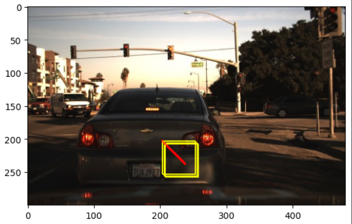

## TRAJECTORY PREDICTION 

# WHAT I DID / PIPELINE

Took a windshield-view dataset with bounding boxes, preprocessed it (kept most prominent BB), normalized centers, and used transfer learning (MobileNetV2 pretrained on ImageNet). Re-trained top a bit to predict center (x,y) of vehicle/pedestrian.
Took last feature map from CNN (important features), reshaped and fed to RNN: timesteps = spatial dim, features = channels of final feature map.
Trained LSTM for one-step forecasting (predict next (x,y)).
Upgraded to multi-step forecasting (predict future 10 steps) using a TimeDistributed-like approach to process 10 images first, then LSTM.
Draw bounding boxes around the predicted future coordinates and render on video frames.
Notes: used Functional API, concatenated image features + current bbox centers for better prediction, incremental re-training and saved models as .h5
KEY POINTS / DESIGN DECISIONS

Transfer learning: MobileNetV2 (include_top=False) → GlobalAveragePooling → Dense head to predict center.
Time processing: custom TimeDistributedBaseModel that reshapes (batch*time, H, W, C) → CNN → reshape back (batch, time, -1)
LSTM model inputs: (images sequence, labels sequence) → stacked LSTM → Dense(20) → reshape to (10,2) for 10 step outputs.
Training trick: scale center coords with StandardScaler, then inverse transform for visualization.
Visualization: draw rectangles/lines on frames, convert BGR→RGB for matplotlib, save or compose a video

# KEY POINTS / DESIGN DECISIONS

Transfer learning: MobileNetV2 (include_top=False) → GlobalAveragePooling → Dense head to predict center.
Time processing: custom TimeDistributedBaseModel that reshapes (batch*time, H, W, C) → CNN → reshape back (batch, time, -1)
LSTM model inputs: (images sequence, labels sequence) → stacked LSTM → Dense(20) → reshape to (10,2) for 10 step outputs.
Training trick: scale center coords with StandardScaler, then inverse transform for visualization.
Visualization: draw rectangles/lines on frames, convert BGR→RGB for matplotlib, save or compose a video.

# LIMITATIONS / THINGS I NOTICED

Naive iterative multi-step (feeding previous predicted box image back) produced error propagation and low diversity.
TimeDistributed approach (process all 10 images first then LSTM) works much better.
Small training data and naive bbox drawing at training time limit generalization — need larger, varied trajectories and augmentation.
Scaling/inverse transform must be consistent to avoid coordinate errors when drawing

# IMPACT / WHY THIS MATTERS

Shows an end-to-end experiment: from images + bbox center extraction to multi-step forecasting and visualization. Demonstrates transfer learning, custom time-distributed feature extraction, functional API LSTM, and practical visualization — all skills recruiters for ML/CV roles look for.
